# Architecture: how the pieces fit together

**Scope:** the whole `tunmux` binary, all three roles it runs in.

One binary, three roles. Which role a process takes is decided in
`main()` (`src/main.rs:26`) before the CLI is even parsed:

- **helper** if `TUNMUX_GOTATUN_HELPER` is set in the environment
  (`userspace_helper::maybe_run_from_env`, `src/userspace_helper.rs:235`),
- **privileged service** for the hidden `tunmux privileged --serve` subcommand,
- **user CLI** for everything else.

The user CLI never touches routes, DNS, or the WireGuard control socket. It
sends a JSON request to the privileged service over a Unix socket, and the
service either does the work itself or spawns a per-tunnel helper process that
owns the tunnel for its lifetime.

## Processes and the privilege boundary

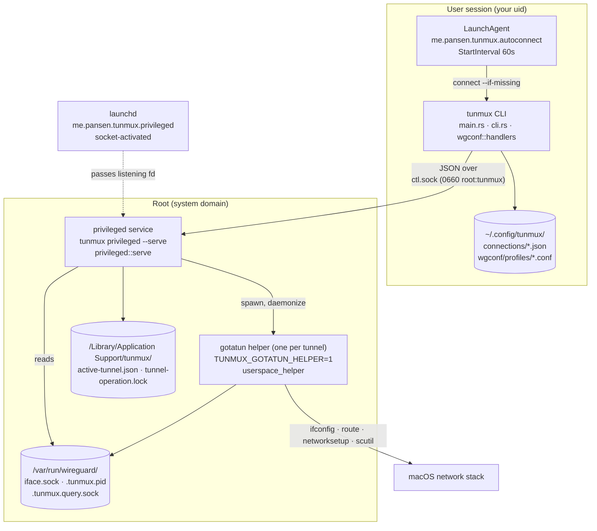

The boundary is the socket. Everything above it runs as you and is replaceable;
everything below it runs as root and is deliberately small. `trusted_exec`
(`src/trusted_exec.rs`) guards what root is allowed to execute: a fixed
allowlist of tool names, each resolved to an absolute path and validated for
root ownership before the `Command` is built.

## The main types

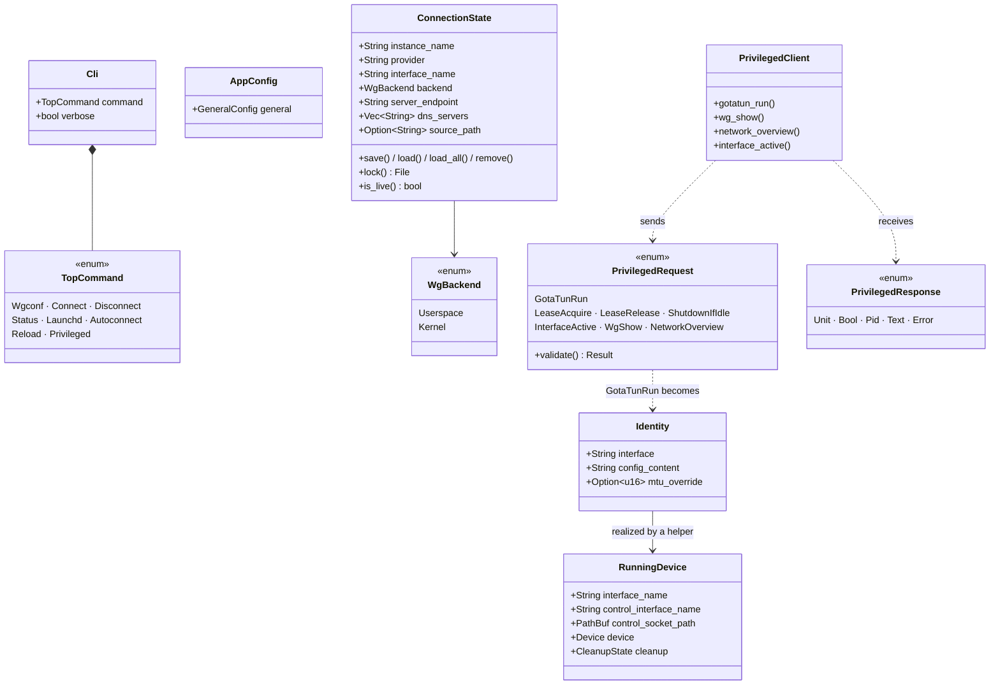

`ConnectionState` is the user-side record of a connection, one JSON file per
instance under `~/.config/tunmux/connections/`. `Identity` is the root-side
record, one per host, and the two are deliberately independent: the daemon
never trusts what the CLI claims is running.

## One connect, end to end

This is `tunmux connect wgconf --file home.conf` with the default `userspace`
backend, which is also what the autoconnect agent runs every 60 seconds with
`--if-missing` appended.

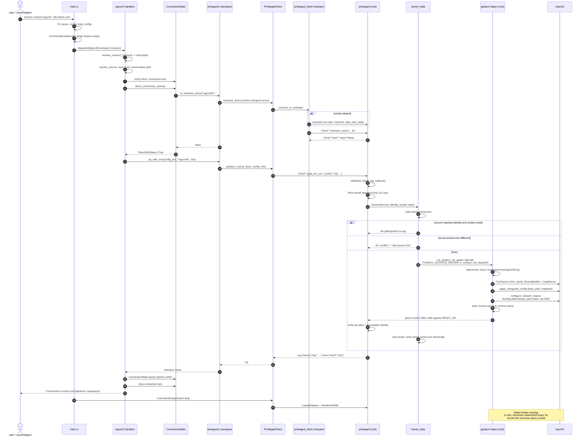

The parts worth noticing:

The daemon, not the CLI, decides whether a tunnel already exists. The CLI's
`--if-missing` only skips its own "already connected" bail; the authoritative
check is `tunnel_state::connect` comparing the requested `Identity` against the
record plus the socket's device, inode, and ctime
(`src/privileged/tunnel_state.rs:40`). A config that differs by so much as
whitespace is a conflict, not a reconnect.

Log output flows backwards over the same connection. Before dispatching a
`GotaTunRun` the daemon starts a capture (`logging::begin_log_capture`) and
notes the helper log's size and inode; afterwards it merges its own captured
lines with the new tail of the helper log by timestamp and writes them as
`{"log": "..."}` frames ahead of the response frame
(`src/privileged/mod.rs:215`). The client prints those to stderr and only
returns on the response frame (`read_framed_response`,
`src/privileged_client/transport.rs`). That is why `tunmux reload -v` shows you
what the root side actually did.

## Command dispatch

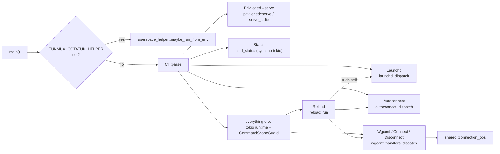

`Status`, `Launchd`, and `Autoconnect` are synchronous and skip the tokio
runtime and the lease scope entirely, because none of them holds a privileged
session open. `reload::run` is unusual in that it calls three other commands in
sequence and re-executes the binary under `sudo` for the one step that needs
root (`src/reload.rs:52`).

`shared::connection_ops` holds the logic every provider-scoped command shares:
backend resolution, the disconnect fan-out (single instance, all of a provider,
all providers), and `direct_connection_active`, which clears stale state left
by a reboot instead of letting it wedge future connects.

## Backends

Both backends terminate at the same daemon and the same embedded gotatun
engine. What differs is what config they send with the `GotaTunRun` request.

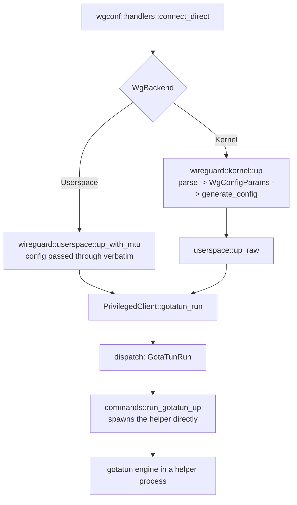

`kernel` is a misnomer inherited from Linux: macOS has no in-kernel WireGuard,
so `wireguard::kernel::up` regenerates a minimal config from the parsed one and
hands it to the same userspace path (`src/wireguard/kernel.rs:15`). Neither
backend needs externally installed tools; `trusted_exec` only ever resolves a
fixed set of system binaries.

`ConnectionState::is_live()` collapses back to one probe for all three: ask the
daemon whether `/var/run/wireguard/<iface>.sock` exists. A local `exists()`
would be permission-blind, since that directory is `0750 root:daemon`, and the
false negative used to drive a reconnect storm from the autoconnect agent
(`src/wireguard/userspace.rs:73`).

## Inside the privileged service

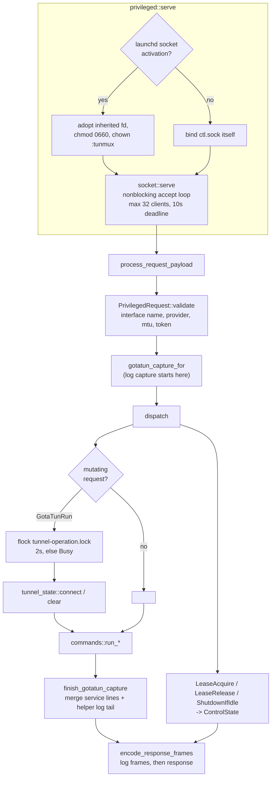

The accept loop and the dispatcher share a thread, which is why the mutation
lock is bounded: an unbounded `flock` there would freeze every unrelated client
behind one slow tunnel operation, so a contended lock returns a `Busy` error
instead (`src/privileged/dispatch.rs:16`).

Lifetime is controlled by `ControlState`. Clients acquire a lease for the
duration of a command scope (`CommandScopeGuard`, `src/privileged_client/mod.rs:58`)
and release it on drop, followed by `ShutdownIfIdle`. The daemon exits only if
it was autostarted, shutdown was requested, and no live lease remains;
`prune_stale_leases` drops tokens whose owning process died.

There is a second transport, `stdio`, selected by config. It spawns a dedicated
daemon per caller over stdin/stdout instead of connecting to the shared socket.
Both paths reach the same `dispatch` and share the same on-disk lock, so a
stdio daemon cannot take over a tunnel a socket daemon owns.

## Inside the helper

One helper process per tunnel. It is spawned by the daemon, daemonizes, and
then owns the tunnel until its UAPI socket is removed or it is signalled.

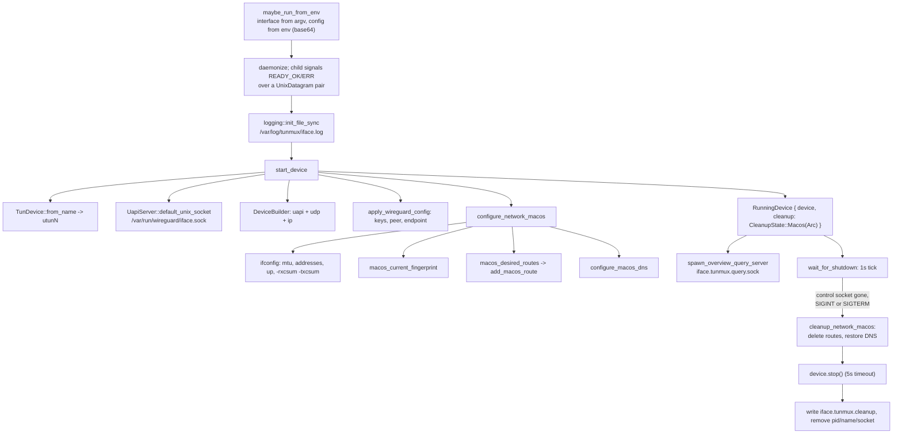

Teardown is a handshake, not a kill. `run_gotatun_down` removes the UAPI socket,
which the helper's tick loop reads as a shutdown request, then waits up to 15
seconds for the helper to write `ok` into its cleanup-status file, falling back
to `SIGTERM` and a further 5 seconds. Only after a confirmed `ok` does it check
that the `utunN` interface is really gone (`src/privileged/commands.rs`, `run_gotatun_down`).

## Continuous reconciliation

This is the part that makes the tunnel survive roaming. Every 3 seconds the
helper re-snapshots the network and, if anything moved, re-applies routes and
DNS.

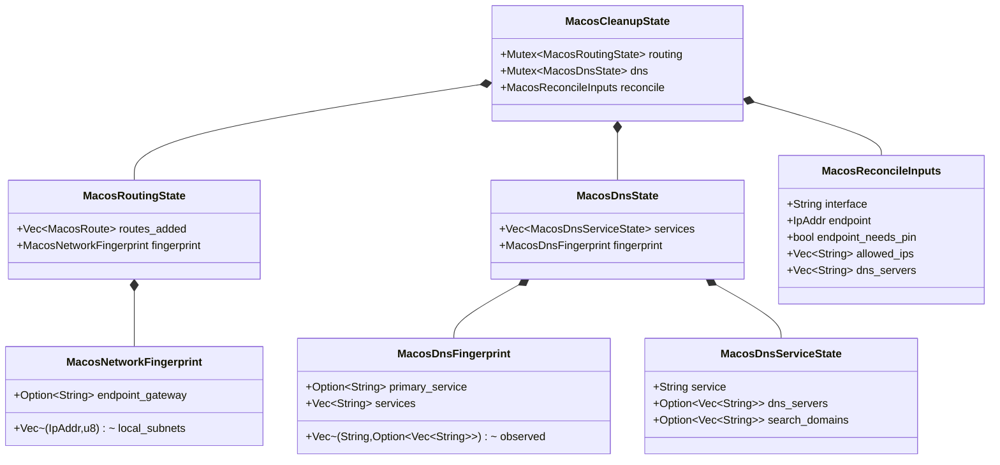

Both reconcilers follow the same shape: snapshot the environment into a
fingerprint, compare it to the stored one, and act only on a difference. Both
run on `spawn_blocking` via `run_macos_maintenance`, awaited so ticks cannot
overlap and teardown cannot race a worker mid-change, and so the shelling out
to `ifconfig`/`scutil`/`networksetup` never stalls the single-threaded runtime
that is also moving packets.

Routes: `macos_desired_routes` is the endpoint pin (only when AllowedIPs would
otherwise capture the endpoint) plus the AllowedIPs routes, minus anything that
falls inside a directly-connected subnet. That subtraction is what keeps the
split tunnel from hijacking the LAN you are actually on.

The subtraction alone is not enough, because a prefix can only hold one entry.
Joining a LAN the tunnel already routes (roaming into a subnet that is also in
AllowedIPs) means the kernel cannot install that interface's connected route,
and the tunnel route it lost out to is removed on the next reconcile, leaving
the LAN with no route at all. Two rules close that gap. `add_macos_route`
checks who holds a prefix before touching it, clearing a stale entry only when
a tunnel device owns it and otherwise leaving the prefix alone and unowned, and
`macos_restore_shadowed_lan_route` re-adds the connected route, scoped to its
device, whenever removing a tunnel route leaves a local subnet uncovered.

DNS: `plan_dns_actions` is deliberately I/O-free and therefore unit-testable. It
takes the tunnel's DNS, the observed environment, the services currently owned,
and the services that should be owned, and returns what to apply, restore, or
drop. Under the active `PrimaryOnly` policy only the service owning global
resolution gets tunnel DNS. `dns_reconcile_forced` handles the case a
fingerprint cannot see: a DHCP-provided resolver on a LAN that shadows the
tunnel's own DNS server address, where nothing observable changes but ownership
still has to move.

## Locks and state files

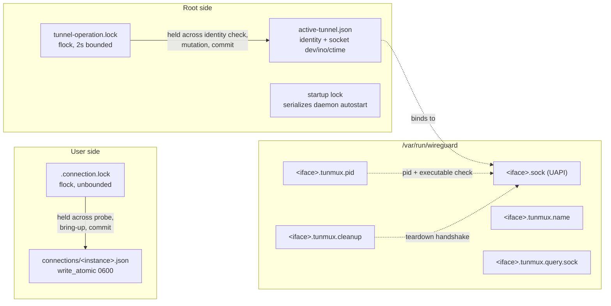

`state_file` (`src/state_file.rs`) provides both primitives: `lock` /
`lock_with_timeout` over `flock` with `O_NOFOLLOW`, and `write_atomic`, which
writes a randomly named temp file at mode 0600 and renames it into place. Every
piece of state on both sides of the boundary goes through those two functions.

## Status

`tunmux status` is read-only and pulls from three places at once.

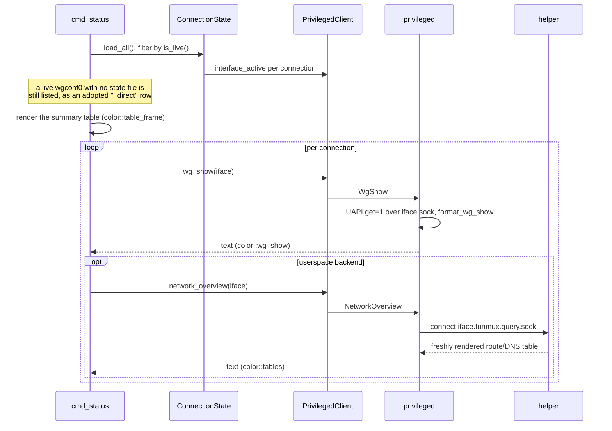

Both detail fetches are best-effort: a failure prints to stderr and never makes
`status` fail. The overview exists only in the helper's memory, so the query
socket is the only way to see it, and it is proxied through the daemon because
the socket is root-only.

## Installation and lifecycle

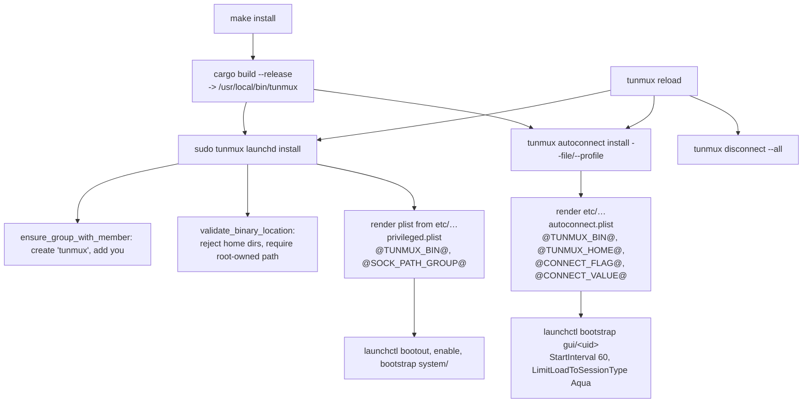

`launchd` handles the root daemon in the system domain; `autoconnect` handles
the per-user agent in the GUI domain. They must not be crossed, which is why
`reload` refuses to run as root and escalates only the daemon step
(`src/reload.rs:80`), and why `autoconnect` has its own `refuse_if_root`.

`autoconnect::reinstall` reads the currently installed plist to recover the
`--file` or `--profile` it was registered with, so `tunmux reload` with no
arguments reconnects the same profile you already had
(`installed_connect_source`, `src/autoconnect.rs`).

## Where to start reading

| Question | File |
| --- | --- |
| What commands exist and what do they take? | `src/cli.rs` |
| What happens for a connect? | `src/wgconf/handlers.rs`, `connect_direct` |
| What crosses the privilege boundary? | `src/privileged_api.rs` |
| How does the client reach root? | `src/privileged_client/transport.rs` |
| What does root actually run? | `src/privileged/commands.rs`, `src/trusted_exec.rs` |
| How is tunnel identity decided? | `src/privileged/tunnel_state.rs` |
| How do routes and DNS stay correct? | `src/userspace_helper.rs`, `macos_reconcile_routes` / `macos_reconcile_dns` |
